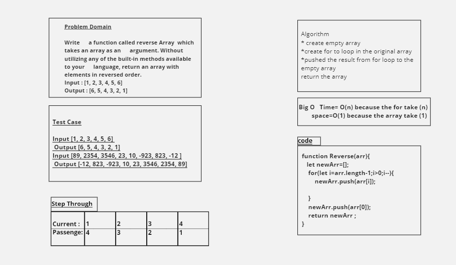

# Reverse an Array

<!-- Description of the challenge -->

```js
function Reverse(arr) {
  let newArr = [];
  for (let i = arr.length - 1; i > 0; i--) {
    newArr.push(arr[i]);
  }
  newArr.push(arr[0]);
  return newArr;
}
```

## Whiteboard Process

<!-- Embedded whiteboard image -->



## Approach & Efficiency

<!-- What approach did you take? Discuss Why. What is the Big O space/time for this approach? -->

- looping because its familiar to me

- Big O time is : O(n) / space : O(1)

---

---

# Insert to Middle of an Array

<!-- Description of the challenge -->

```js
function insertShiftArray(arr) {
  let newArr = [];
  let mid = arr.length / 2;
  for (let i = 0; i < arr.length; i++) {
    if (i < mid) {
      newArr.push(arr[i]);
    } else if (i == mid) {
      newArr.push(x);
      newArr.push(arr[i]);
    } else {
      newArr.push(arr[i]);
    }
  }
  return newArr;
}
```

## Whiteboard Process

<!-- Embedded whiteboard image -->

.png>)

## Approach & Efficiency

<!-- What approach did you take? Discuss Why. What is the Big O space/time for this approach? -->

- Nested if inside for loop because its familiar to me.

- Big O time is : O(n) / space : O(n)

---
---

## Singly Linked List
<!-- Short summary or background information -->
Singly linked list can be defined as the collection of ordered set of elements. The number of elements may vary according to need of the program. A node in the singly linked list consist of two parts: data part and link part. Data part of the node stores actual information that is to be represented by the node while the link part of the node stores the address of its immediate successor.

## Challenge
<!-- Description of the challenge -->
1. Create Node.
2. Create Linked List with constructor.
3. Add some function like (insert/includ/toString).
4. Create a test file (testing the linked list).
5. If all test pass do ACP.

.png)
.png)

## Approach & Efficiency

<!-- What approach did you take? Why? What is the Big O space/time for this approach? -->
- I take while loop and if condition because its familiar to me.
- Big O time is : O(n) / space : O(n)

## API
<!-- Description of each method publicly available to your Linked List -->
1. insert : its take a data and stored in the head.
2. includ : its take a data and compare it whit the existing data , if found it return true , if not return false.

3. toString : its take noting and retur all the data in the head.
