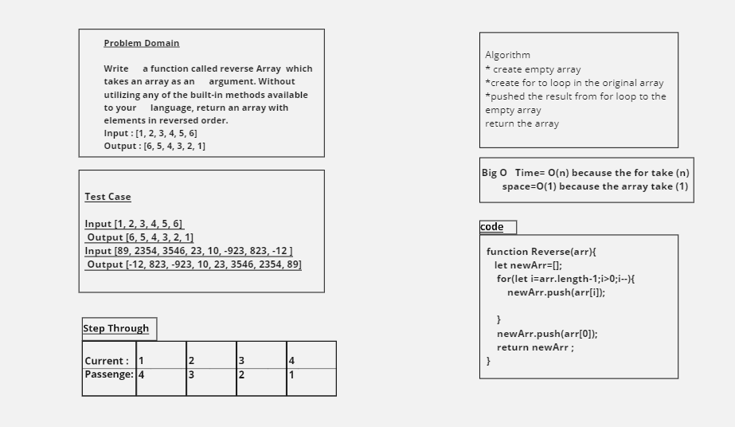

# Reverse an Array

<!-- Description of the challenge -->

```js
function Reverse(arr) {
  let newArr = [];
  for (let i = arr.length - 1; i > 0; i--) {
    newArr.push(arr[i]);
  }
  newArr.push(arr[0]);
  return newArr;
}
```

## Whiteboard Process

<!-- Embedded whiteboard image -->



## Approach & Efficiency

<!-- What approach did you take? Discuss Why. What is the Big O space/time for this approach? -->

- looping because its familiar to me

- Big O time is : O(n) / space : O(1)
