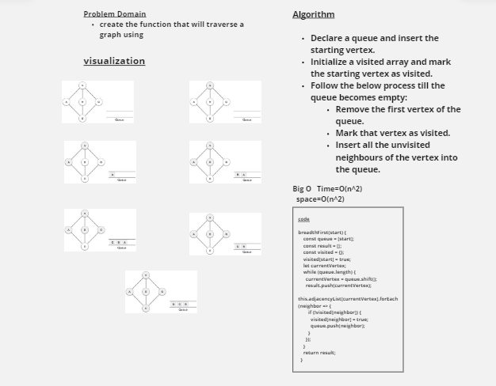

# Graphs

## Challenge

<!-- Description of the challenge -->
create the function that will traverse a graph using Breadth First

## Approach & Efficiency

<!-- What approach did you take? Why? What is the Big O space/time for this approach? -->
The big O For Time And Space = big O(n^2)

## White board

