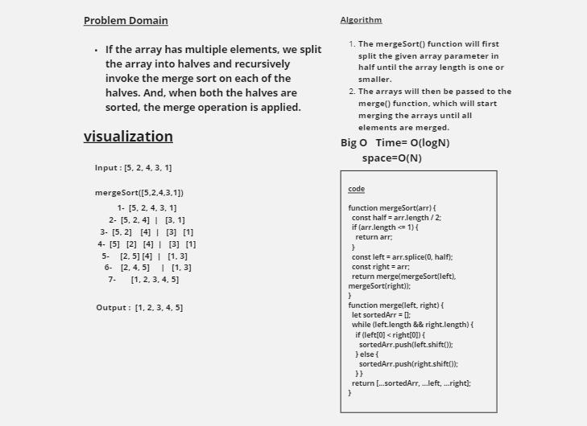
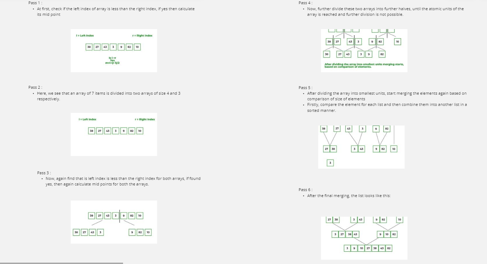
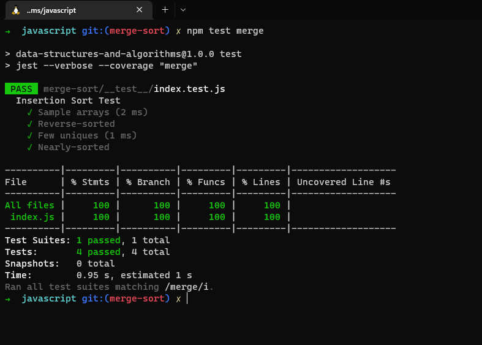

# Challenge Summary

## Merge Sort
<!-- Description of the challenge -->
If the array has multiple elements, we split the array into halves and recursively invoke the merge sort on each of the halves. And, when both the halves are sorted, the merge operation is applied.

## Whiteboard Process
<!-- Embedded whiteboard image -->

## Approach & Efficiency
<!-- What approach did you take? Why? What is the Big O space/time for this approach? -->
Big O   Time= O(logN)
        space=O(N)

## Test

