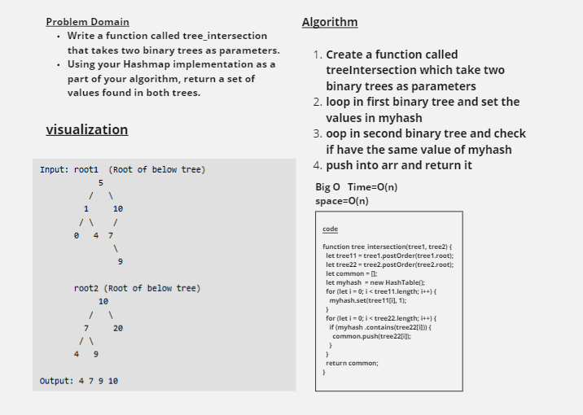
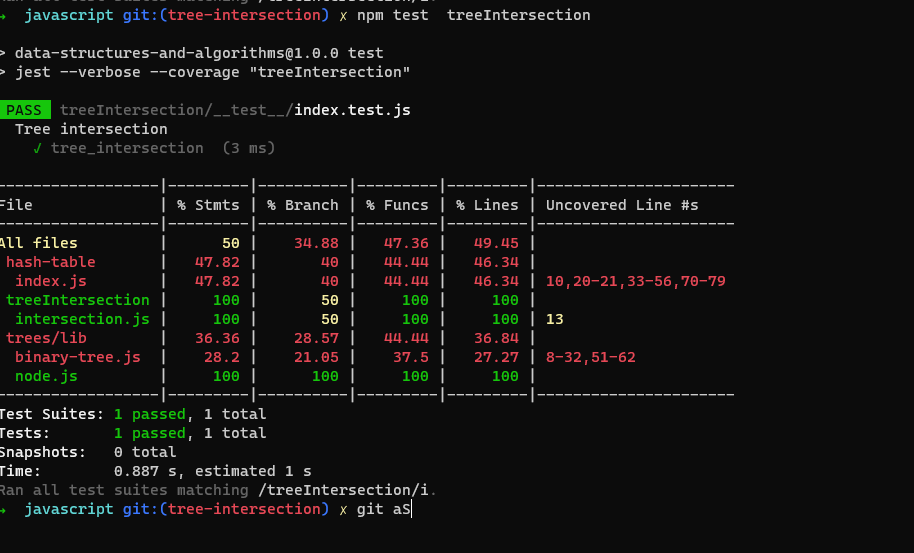

# Tree Intersection

Write a function called tree_intersection that takes two binary trees as parameters.
Using your Hashmap implementation as a part of your algorithm, return a set of values found in both trees.

## Whiteboard

## Approach & Efficiency
<!-- What approach did you take? Why? What is the Big O space/time for this approach? -->

The big O For Time And Space = big O(n)

## Image

