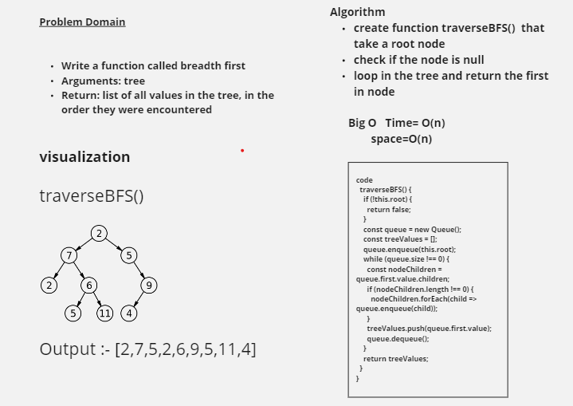

# Trees

## Challenge

- Node
  - Create a Node class that has properties for the value stored in the node, the left child node, and the right child node.
- Binary Tree
  - Create a Binary Tree class
    - Define a method for each of the depth first traversals:
      - pre order
      - in order
      - post order which returns an array of the values, ordered appropriately.
      - find maximum value
        - Arguments: none
        - Returns: number
- Binary Search Tree
  - Create a Binary Search Tree class
    - This class should be a sub-class (or your languages equivalent) of the Binary Tree Class, with the following additional methods:
    - Add
      - Arguments: value
      - Return: nothing
      - Adds a new node with that value in the correct location in the binary search tree.
- Contains
  - Argument: value
  - Returns: boolean indicating whether or not the value is in the tree at least once.

- Write a function called breadth first
  - Arguments: tree
  - Return: list of all values in the tree, in the order they were encountered

## Whiteboard Process

.png)

## Approach & Efficiency
<!-- What approach did you take? Why? What is the Big O space/time for this approach? -->

The big O For Time And Space = big O(n)

## Image

.png)
.png)
